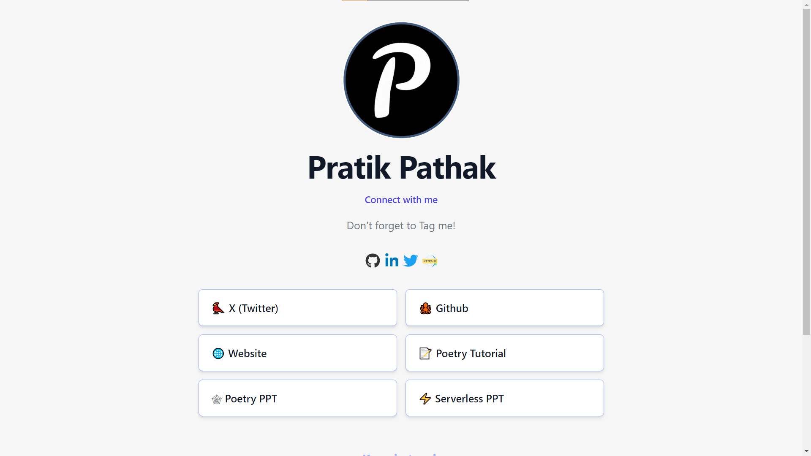

# 4. Connect ME

This is the clone of LinkTr.ee, those who don't want to use LinkTr.ee can use this static application to share links with the audience. It is built using HTML, CSS, JS, and a little bit of node.js.

