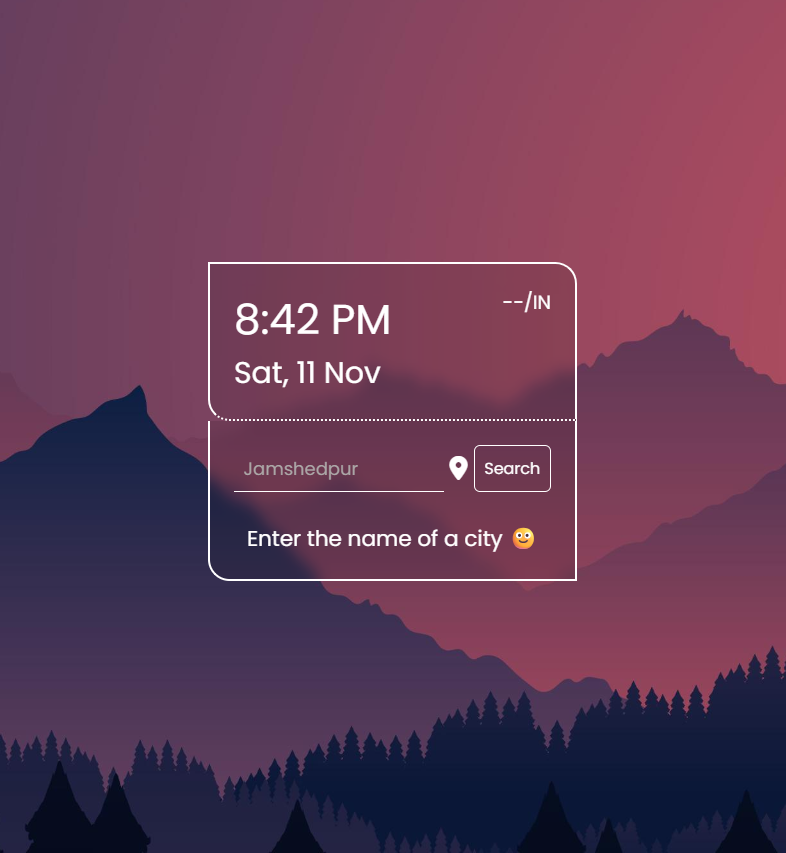

# 🌤️ Weather App

A modern, responsive weather application that provides real-time weather information for any city worldwide. Built with vanilla JavaScript, HTML, and CSS, this app features an elegant glassmorphism design with integrated time display and geolocation support.



## ✨ Features

### 🔍 **Weather Search**
- Search weather information for any city worldwide
- Real-time weather data from OpenWeatherMap API
- Temperature display in Celsius with "feels like" temperature
- Weather condition icons and descriptions
- Error handling for invalid city names

### 📍 **Geolocation Support**
- Get weather information for your current location
- One-click location detection using browser's geolocation API
- Automatic weather update based on GPS coordinates

### ⏰ **Live Time Display**
- Real-time digital clock with 12-hour format
- Current date display with day, date, and month
- Updates every second for accurate time keeping

### 🎨 **Modern UI/UX**
- Glassmorphism design with backdrop blur effects
- Responsive design that works on all device sizes
- Beautiful background imagery
- Smooth animations and transitions
- Font Awesome icons for enhanced visual appeal

### 🌐 **Location Display**
- Shows current city and country information
- Updates dynamically based on search or geolocation

## 📁 Project Structure

```
05-Weather-App/
├── index.html          # Main HTML structure
├── style.css           # Styling and responsive design
├── script.js           # JavaScript functionality
├── README.md           # Project documentation
└── img/
    ├── bg.jpg          # Background image
    └── favicon/        # Favicon files
        ├── apple-touch-icon.png
        ├── favicon-32x32.png
        ├── favicon-16x16.png
        └── site.webmanifest
```

## 🛠️ Technologies Used

- **HTML5**: Semantic markup and structure
- **CSS3**: Modern styling with Flexbox, glassmorphism effects
- **Vanilla JavaScript**: Core functionality and API integration
- **OpenWeatherMap API**: Real-time weather data
- **Font Awesome**: Icon library
- **Google Fonts**: Typography (Poppins, Roboto)
- **Geolocation API**: Browser location services

## 📋 Prerequisites

Before running this project, make sure you have:

- Basic knowledge of **HTML5**
- Basic knowledge of **CSS3** (Flexbox, responsive design)
- Basic knowledge of **JavaScript** (ES6+, Fetch API, DOM manipulation)
- Understanding of **API integration**
- Knowledge of **Asynchronous JavaScript** (Promises, async/await)

## ⚙️ Installation & Setup

### 1. Clone the Repository
```bash
git clone https://github.com/ashishgit10/25-Javascript-Projects-for-beginner.git
cd 25-Javascript-Projects-for-beginner/05-Weather-App
```

### 2. Get OpenWeatherMap API Key
1. Visit [OpenWeatherMap](https://openweathermap.org/api)
2. Create a free account
3. Generate your API key
4. Replace the API key in `script.js`:
   ```javascript
   var key = "YOUR_API_KEY_HERE";
   var key2 = "YOUR_API_KEY_HERE";
   ```

## 🎯 How to Use

### Search by City Name
1. Type the city name in the search input field
2. Click the "Search" button
3. View the weather information displayed

### Use Current Location
1. Click the location icon (📍) next to the search bar
2. Allow location access when prompted by the browser
3. The app will automatically fetch weather for your current location

### Features Display
- **Time**: Shows current time in 12-hour format with AM/PM
- **Date**: Displays current day, date, and month
- **Location**: Shows city and country
- **Temperature**: Current temperature and "feels like" temperature
- **Weather**: Weather condition with appropriate icon

## 🔧 API Integration

This project uses the **OpenWeatherMap API** for weather data:

### Endpoints Used:
- **By City Name**: `https://api.openweathermap.org/data/2.5/weather?q={city}&appid={key}`
- **By Coordinates**: `https://api.openweathermap.org/data/2.5/weather?lat={lat}&lon={lon}&appid={key}`

### Data Retrieved:
- Temperature (converted from Kelvin to Celsius)
- Weather conditions and descriptions
- Weather icons
- Location information (city, country)
- "Feels like" temperature

## 🎨 Styling Features

### Glassmorphism Design
- Semi-transparent containers with backdrop blur
- Border styling with dotted effects
- Subtle shadows and overlays

### Responsive Design
- Flexible layouts using CSS Flexbox
- Minimum width constraints for mobile compatibility
- Scalable typography and spacing

### Visual Elements
- Background image with proper positioning
- Weather condition icons from OpenWeatherMap
- Font Awesome icons for UI elements
- Custom color scheme with white text on dark overlay

## 🔍 Code Structure

### HTML (`index.html`)
- Semantic HTML5 structure
- Meta tags for responsive design and PWA support
- Favicon integration
- Clean, accessible markup

### CSS (`style.css`)
- Modern CSS with custom properties
- Flexbox layouts for responsive design
- Glassmorphism effects using backdrop-filter
- Mobile-first responsive approach

### JavaScript (`script.js`)
- Modular function structure
- Event-driven programming
- Error handling for API calls and user inputs
- Real-time clock functionality
- Geolocation integration


**Made with ❤️ for Hacktoberfest 2025**

*Happy Coding! 🚀*
