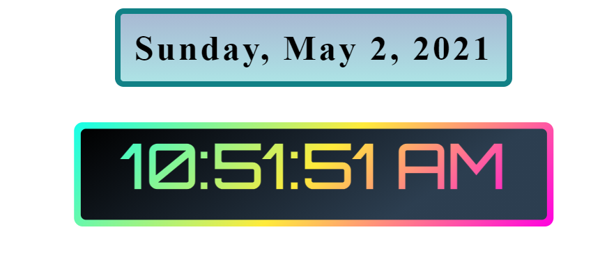

# Digital_Clock
A digital clock or watch in which the hours, minutes, and sometimes seconds are indicated by digits, as opposed to an analog clock, where the time is indicated by the positions of rotating hands. 

## Prerequisite
- Basic knowledge of HTML
- Basic knowledge of CSS
- Basic knowledge of JavaScript

