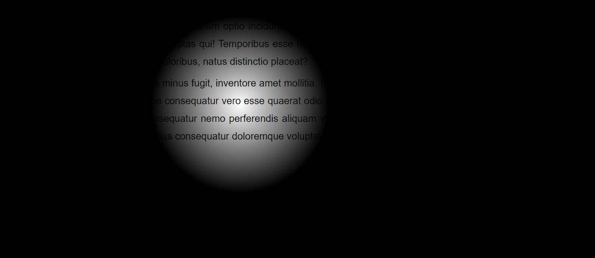

# 7. FlashLight Effect

It is a simple application for mouse tracking. There is a dark web page with some text in it and wherever the mouse goes it illuminates its surrounding area. Beautifully built using Vanilla JS.

Technologies Used: Javascript, HTML, CSS

