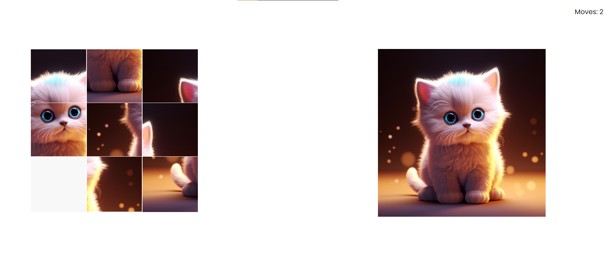

# 8. Puzzle Game

A Puzzle Game is a project that contains misplaced pieces of an image, You have to rearrange the missing pieces so that they become the same as the right side image.

Technologies Used: Javascript, HTML, CSS

