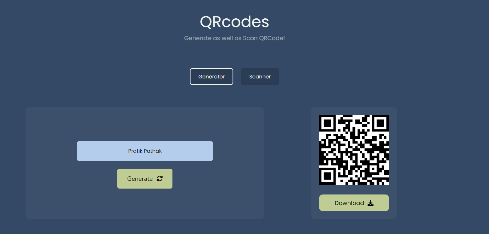

# 8. QR Code

A simple application to make QR code as well as it can read it, with a beautiful UI. Works on a local server. Created by Using QrCode.js package.

Technologies Used: QrCode.js, Javascript, HTML, CSS

