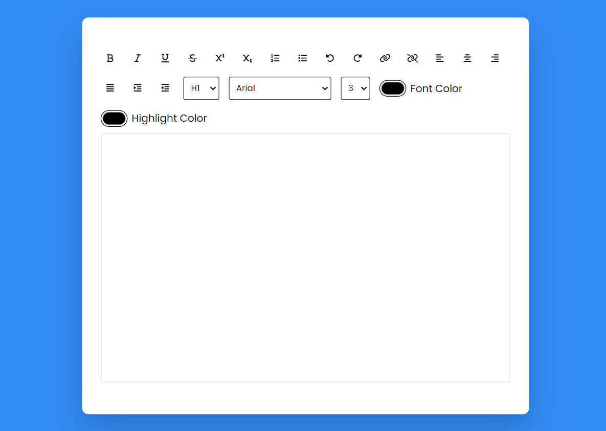

# 10. Rich Text Editor

Have you ever used Microsoft Word? and wondered how you can make one? A rich text editor is a Word-like editor with contains a ribbon that has all the functionality like Bold, Italic, Text Formatting, etc.

Technologies Used: Javascript, HTML, CSS

