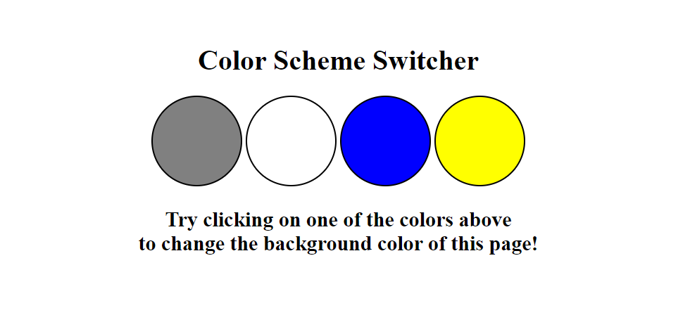

# 11. Background Color Switcher

The Background of the application will change based on the user's color selection. The user has two clicks on his desired color and the whole background color will change.

Technologies Used: Javascript, HTML, CSS, DOM Manipulation

