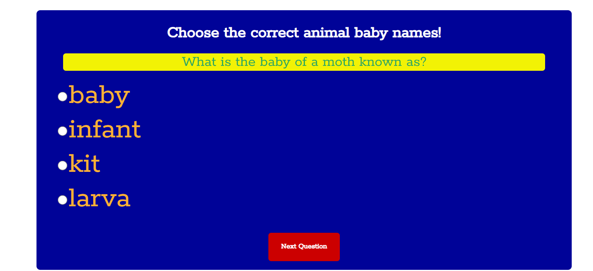

# 16. Quiz APP

A simple web-based quiz about baby animal names. The HTML file sets up the structure of the quiz, including a container for the quiz, a heading, a section for the question, a list for multiple-choice answers, a message area, a result area, and a button to proceed to the next question.

