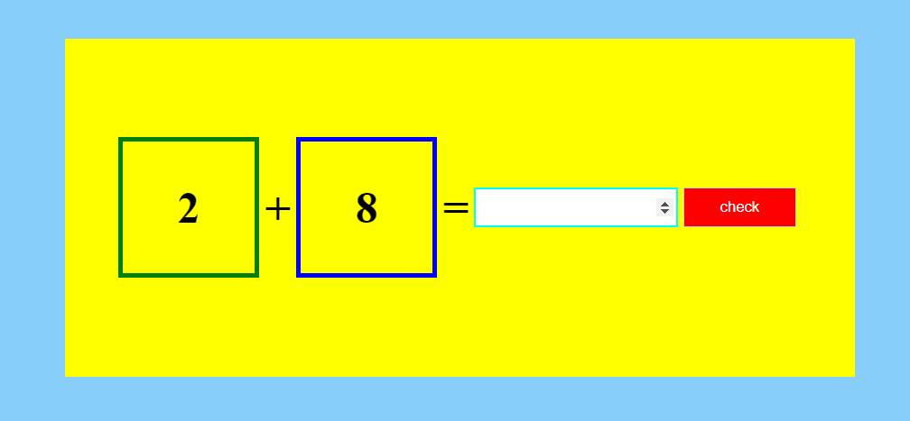

# 17. Math Addition

A simple web-based arithmetic game, specifically designed for addition operations. The HTML file sets up the structure of the game, which includes a canvas area containing two numbers and an addition sign. The user is expected to input their guess for the sum of the two numbers in an input field. A button is provided to check the user's answer.

