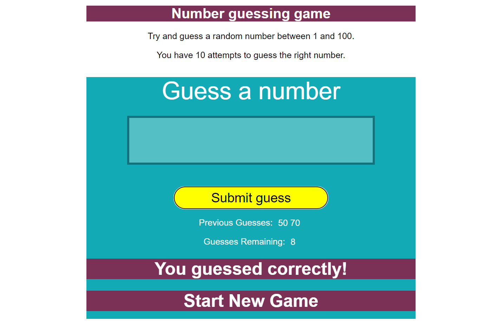

# 17. Guess The Number

This project is a number guessing game where the user attempts to guess a random number between 1 and 100 within 10 tries. The game's interface, styled with CSS and powered by JavaScript, provides feedback on previous guesses and the number of remaining attempts.

