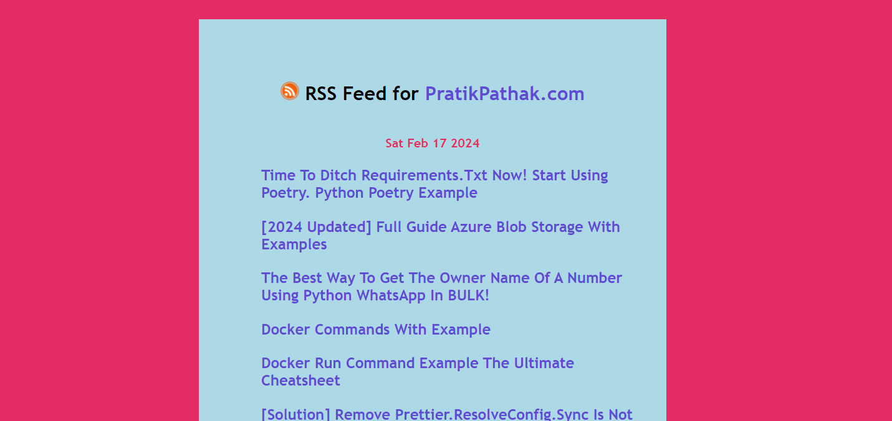

# 19. RSS News Feed

This project is a simple RSS News Feed reader. The HTML file sets up the structure of the application, which includes a heading with an RSS icon and a title that will display the name of the selected news source (defaulted to "BBC News - World"). There's also a date section and a main content area where the news feed will be displayed in a list format.

