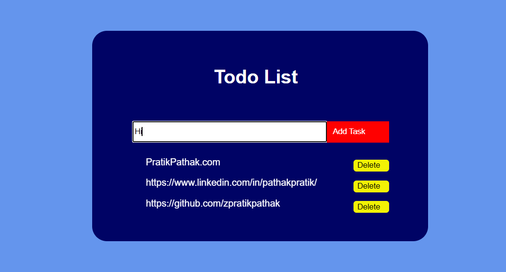

# 20. Session Storage To-Do List

This project is a simple Todo List application. The HTML file sets up the structure of the application, which includes a heading, an input field for entering tasks, and a button for adding tasks. There's also a dedicated area where the tasks will be displayed.

