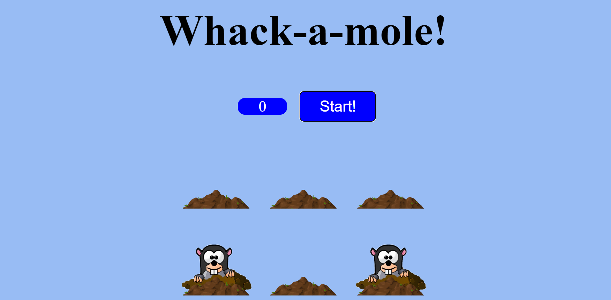

# 21. Whack a Mole

This project is a web-based game called "Whack-a-Mole". The HTML structure includes a score display, a start button, and a game area with six "holes", each containing a "mole". The game's visual styling is linked via a CSS file named "styles.css", and the functionality is provided by a JavaScript file named "script.js". The user is expected to "whack" the moles by clicking on them as they randomly appear from the holes

