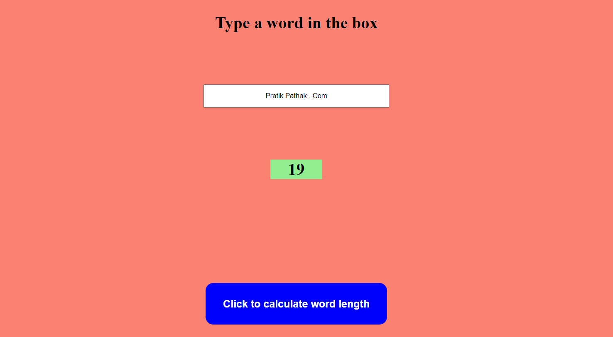

# 22. Word Counter

This project is a simple web-based Word Length Calculator. The HTML file sets up the structure of the application, which includes a heading, an input field for entering a word, a display area for the output, and a button to trigger the calculation.

