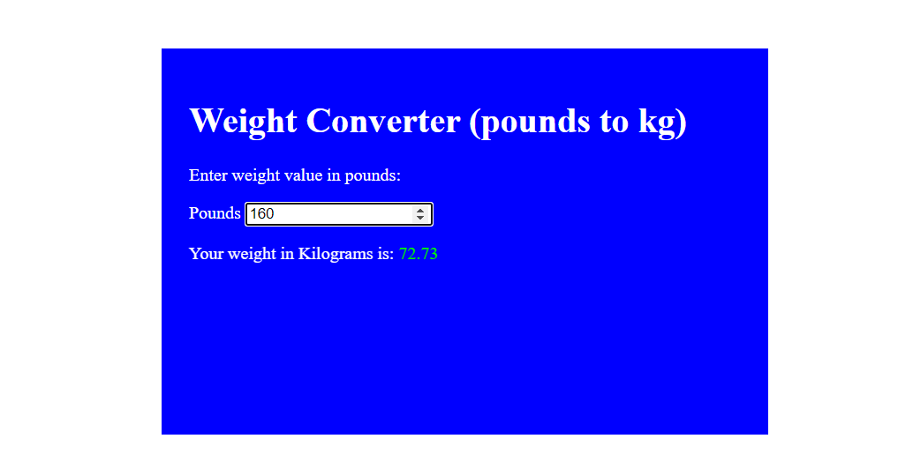

# 23. Weight Conversion

This project is a simple web-based Weight Conversion Tool. The HTML file sets up the structure of the application, which includes a form with a heading, an input field for entering a weight in pounds, and a display area for the converted weight in kilograms.

