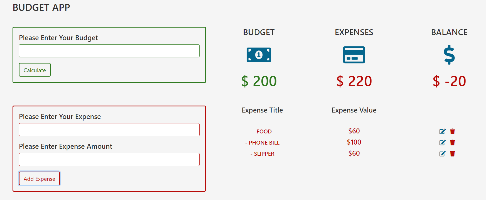

# 24. Expense Calculator

This project is a Budget App, a web-based application that allows users to manage their budget and expenses. The HTML structure includes sections for entering a budget, displaying the current budget, expenses, and balance, and entering expenses.

