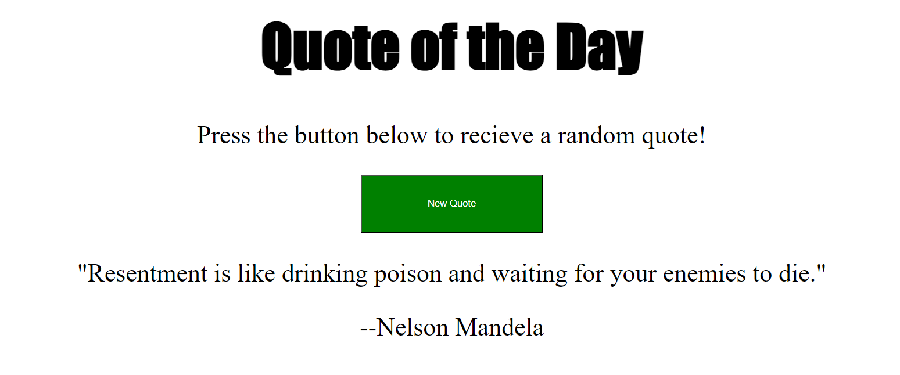

# 25. Random Quote

This project is a simple web-based "Quote of the Day" application. The HTML file sets up the structure of the application, which includes a heading, a paragraph instructing the user to press a button to receive a random quote, a button that triggers the quote generation, and two paragraphs where the quote and its author will be displayed.

