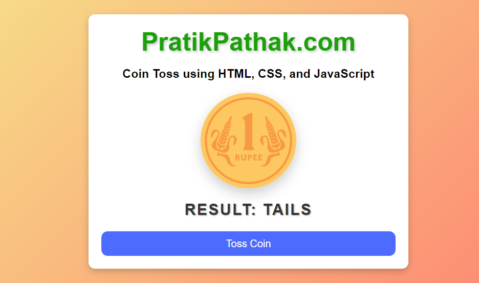

# 26. Toss a Coin

This project is a simple web-based Coin Toss game. The HTML file sets up the structure of the game, which includes a title, a brief description, an image of a coin, and a button to toss the coin.

