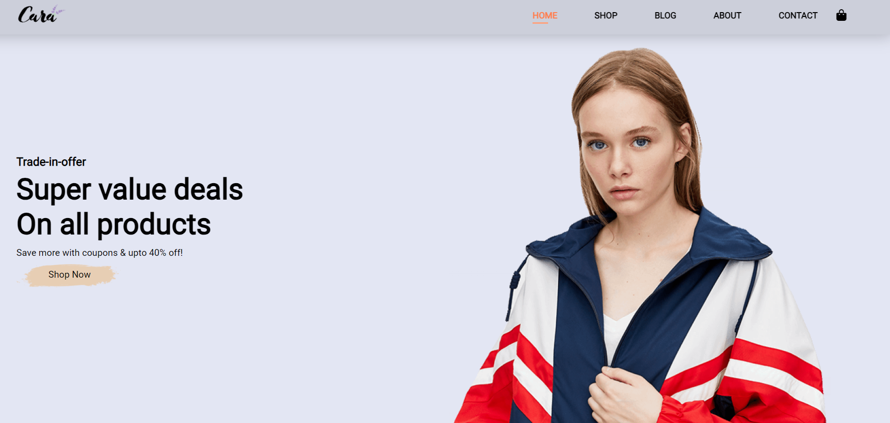
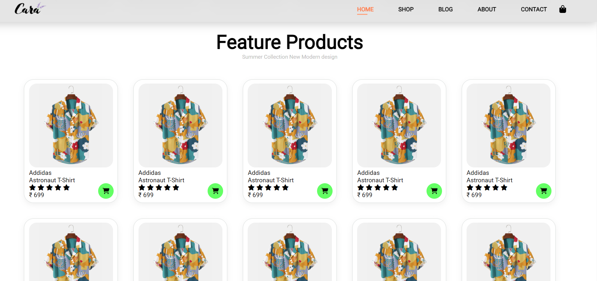
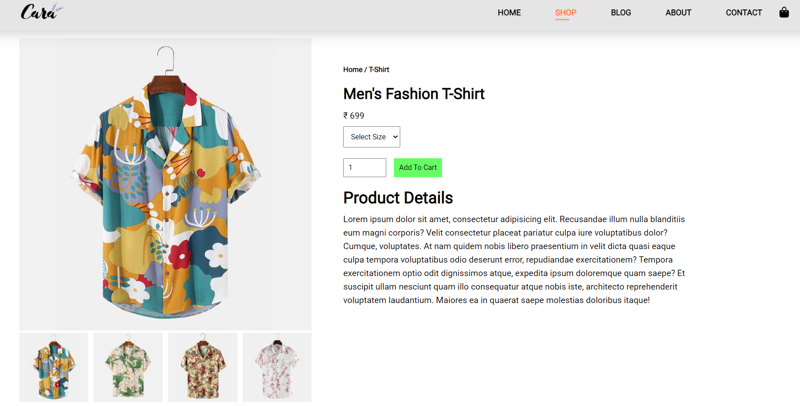

# 🛒 E-Commerce Website

A modern, fully responsive e-commerce website built with vanilla HTML, CSS, and JavaScript. This project features a complete online shopping experience with multiple pages, product galleries, mobile-responsive design, and interactive user interface elements.

## 📸 Screenshots

| Homepage | Shop Page | Single Product |
|----------|-----------|----------------|





## ✨ Features

### 🏠 **Homepage**
- Hero section with promotional banners and call-to-action
- Featured products showcase with ratings and pricing
- Service highlights (Free Shipping, Online Order, Save Money, etc.)
- Newsletter subscription section
- Brand partnerships display

### 🛍️ **Shop Page**
- Complete product catalog with grid layout
- Product filtering and categorization
- Interactive product cards with hover effects
- Add to cart functionality
- Product ratings and reviews display

### 📱 **Single Product Page**
- Detailed product view with multiple images
- Image gallery with thumbnail navigation
- Product specifications and descriptions
- Size and quantity selectors
- Related products recommendations

### 📝 **Blog Section**
- Fashion and lifestyle blog posts
- Article previews with featured images
- Read more functionality
- Category-based content organization

### 🎨 **Modern UI/UX Design**
- Glassmorphism effects with backdrop blur
- Smooth animations and transitions
- Professional color scheme and typography
- Font Awesome icons integration
- Mobile-first responsive design

### 📱 **Mobile Responsive**
- Hamburger menu for mobile navigation
- Touch-friendly interface elements
- Optimized layouts for all screen sizes
- Swipe gestures support


## 📁 Project Structure

```
E-Commerce-Website/
├── index.html              # Homepage with hero section and featured products
├── shop.html               # Product catalog and shopping page
├── single-product.html     # Individual product details page
├── blog.html               # Blog and articles section
├── style.css               # Main stylesheet with responsive design
├── script.js               # JavaScript functionality and interactions
├── README.md               # Project documentation
└── img/                    # Image assets directory
    ├── banner/             # Banner and hero images
    ├── blog/               # Blog post images
    ├── feature/            # Feature icons and graphics
    ├── product/            # Product images and thumbnails
    ├── pay/                # Payment method logos
    ├── logo.png            # Website logo
    ├── hero4.png           # Main hero background
    └── button.png          # UI button elements
```

## 🛠️ Technologies Used

- **HTML5**: Semantic markup and modern web standards
- **CSS3**: Advanced styling with Flexbox, Grid, and animations
- **Vanilla JavaScript**: Interactive functionality and DOM manipulation
- **Font Awesome**: Comprehensive icon library
- **Google Fonts**: Typography (Poppins, Roboto)
- **Responsive Design**: Mobile-first approach with CSS media queries

## 📋 Prerequisites

To understand and work with this project, you should have:

- **HTML5**: Semantic elements, forms, and accessibility
- **CSS3**: Flexbox, Grid, responsive design, animations
- **JavaScript**: DOM manipulation, event handling, ES6+ features
- **Responsive Design**: Mobile-first development principles
- **UI/UX Design**: Understanding of modern web design patterns

## ⚙️ Installation & Setup

### 1. Clone the Repository
```bash
git clone https://github.com/ashishgit10/25-Javascript-Projects-for-beginner.git
cd 25-Javascript-Projects-for-beginner/E-Commerce-Website
```

### 3. Open in Browser
Navigate to `http://localhost:8000` to view the website.

## 🎯 Page Features & Functionality

### 🏠 **Homepage (`index.html`)**
- **Hero Section**: Eye-catching banner with promotional offers
- **Featured Products**: Product grid with star ratings and pricing
- **Services Section**: Key selling points with icons
- **Newsletter**: Email subscription form
- **Footer**: Company information and social links

### 🛍️ **Shop Page (`shop.html`)**
- **Product Grid**: Responsive product display
- **Category Navigation**: Product filtering options
- **Product Cards**: Interactive hover effects
- **Shopping Cart**: Add to cart functionality
- **Pagination**: Product page navigation

### 📦 **Single Product (`single-product.html`)**
- **Image Gallery**: Main product image with thumbnail selector
- **Product Details**: Name, price, description, and specifications  
- **Quantity Selector**: Add to cart with quantity options
- **Size Selection**: Available size options
- **Related Products**: Suggested similar items
- **Product Reviews**: Customer ratings and feedback

### 📝 **Blog Page (`blog.html`)**
- **Article Grid**: Blog post previews
- **Featured Images**: Attractive blog post thumbnails
- **Read More**: Expandable article content
- **Categories**: Content organization and filtering

## 🎨 Design Features

### **Visual Elements**
- **Color Scheme**: Professional coral and neutral tones
- **Typography**: Clean, readable fonts (Roboto, Poppins)
- **Icons**: Font Awesome integration for UI elements
- **Images**: High-quality product and banner images
- **Layout**: Grid-based responsive design

### **Interactive Elements**
- **Hover Effects**: Product cards and navigation links
- **Mobile Menu**: Hamburger navigation for mobile devices
- **Image Gallery**: Clickable thumbnail navigation
- **Form Elements**: Styled input fields and buttons
- **Smooth Scrolling**: Enhanced page navigation experience

### **Responsive Design**
- **Mobile-First**: Optimized for mobile devices
- **Breakpoints**: Tablet and desktop responsive layouts
- **Touch-Friendly**: Large clickable areas for mobile
- **Performance**: Optimized images and CSS

## 🔧 JavaScript Functionality

### **Navigation System**
```javascript
// Mobile menu toggle functionality
const open_nav = document.querySelector(".fa-bars");
const close_nav = document.querySelector(".x-mark");
const nav_active = document.querySelectorAll(".active-open");

// Menu open/close event listeners
open_nav.addEventListener("click", openMobileMenu);
close_nav.addEventListener("click", closeMobileMenu);
```

### **Image Gallery**
```javascript
// Product image switching functionality
const main_img = document.getElementById("main-img");
const list_img = document.getElementsByClassName("list-img");

// Thumbnail click handlers for image gallery
list_img[0].onclick = function() {
    main_img.src = list_img[0].src;
};
```

### **Key Features**
- **Mobile Menu**: Hamburger navigation with smooth transitions
- **Image Gallery**: Dynamic main image switching via thumbnails
- **Event Handling**: Click events for interactive elements
- **DOM Manipulation**: Dynamic content updates
- **Console Logging**: Development debugging features

## 💻 Browser Compatibility

- **Chrome** (Recommended)
- **Firefox**
- **Safari**
- **Edge**
- **Opera**
- **Mobile Browsers** (iOS Safari, Chrome Mobile)

## 📱 Responsive Breakpoints

```css
/* Mobile First Approach */
/* Base styles: 320px and up */

/* Tablet: 768px and up */
@media (min-width: 768px) { ... }

/* Desktop: 1024px and up */
@media (min-width: 1024px) { ... }

/* Large Desktop: 1200px and up */
@media (min-width: 1200px) { ... }
```

## 🎯 Key Learning Concepts

### **HTML5**
- Semantic HTML structure
- Form elements and validation
- Meta tags for SEO and responsive design
- Accessibility best practices

### **CSS3**
- Flexbox and CSS Grid layouts
- CSS animations and transitions
- Media queries for responsive design
- CSS custom properties (variables)
- Glassmorphism and modern design effects

### **JavaScript**
- DOM manipulation and event handling
- ES6+ features and modern JavaScript
- Mobile-first responsive development
- Interactive UI component development

## 🚀 Potential Enhancements

### **E-Commerce Features**
- [ ] Shopping cart with local storage
- [ ] User authentication and login
- [ ] Product search and filtering
- [ ] Wishlist functionality
- [ ] Checkout process simulation
- [ ] Payment gateway integration

### **UI/UX Improvements**
- [ ] Dark mode toggle
- [ ] Product comparison feature
- [ ] Advanced image zoom
- [ ] Loading animations
- [ ] Toast notifications
- [ ] Infinite scroll pagination

### **Technical Enhancements**
- [ ] Progressive Web App (PWA) features
- [ ] API integration for dynamic content
- [ ] State management system
- [ ] Performance optimizations
- [ ] SEO improvements
- [ ] Accessibility enhancements

## 🤝 Contributing

Contributions are welcome! Here's how you can help:

1. **Fork the repository**
2. **Create a feature branch**
   ```bash
   git checkout -b feature/AmazingFeature
   ```
3. **Commit your changes**
   ```bash
   git commit -m 'Add some AmazingFeature'
   ```
4. **Push to the branch**
   ```bash
   git push origin feature/AmazingFeature
   ```
5. **Open a Pull Request**

### **Contribution Ideas**
- Add shopping cart functionality
- Implement product filtering and search
- Create user authentication system
- Add product reviews and ratings
- Implement dark mode
- Add animations and micro-interactions
- Improve accessibility features
- Add payment gateway integration

**🛒 Happy Shopping! Built with ❤️ for Hacktoberfest 2025**

*Ready to dive into e-commerce development? Clone, customize, and create your own online store! 🚀*
