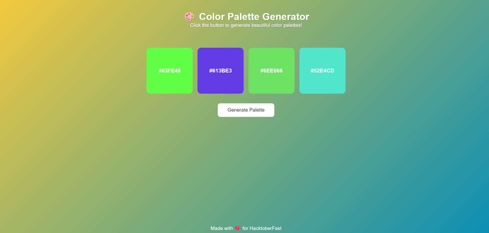

# 🎨 Color Palette Generator

A beautiful, interactive color palette generator that creates stunning color combinations with a single click. Built with vanilla HTML, CSS, and JavaScript, this tool helps designers, developers, and artists discover harmonious color schemes for their creative projects.



## ✨ Features

### 🎯 **Core Functionality**
- **Random Color Generation**: Creates unique hex color combinations
- **One-Click Generation**: Simple button to generate new palettes
- **Visual Color Display**: Beautiful color boxes showing each color
- **Hex Code Display**: Shows the exact hex values for each color
- **Copy to Clipboard**: Click any color to copy its hex code
- **Dynamic Background**: Background gradient changes with each generation

### 🎨 **User Interface**
- **Modern Design**: Clean, minimalist interface with smooth transitions
- **Responsive Layout**: Works perfectly on all device sizes
- **Hover Effects**: Interactive color boxes with scaling animations
- **Visual Feedback**: Smooth transitions and hover states
- **Accessibility**: High contrast text and clear visual hierarchy

### 📱 **Cross Platform**
- **Browser Compatible**: Works on all modern browsers
- **Mobile Friendly**: Touch-optimized for mobile devices
- **Tablet Ready**: Responsive design for all screen sizes
- **Fast Loading**: Lightweight and optimized for performance

## 🚀 Live Demo

[View Live Demo](https://your-demo-link-here.com) *(Add your deployed link here)*

## 📁 Project Structure

```
29-Color-Pallete-Generator/
├── index.html          # Main HTML structure
├── style.css           # Styling and responsive design
├── script.js           # JavaScript functionality
└── README.md           # Project documentation
```

## 🛠️ Technologies Used

- **HTML5**: Semantic markup and structure
- **CSS3**: Modern styling with Flexbox, animations, and gradients
- **Vanilla JavaScript**: Core functionality and DOM manipulation
- **Clipboard API**: Copy-to-clipboard functionality
- **CSS Transitions**: Smooth animations and hover effects

## 📋 Prerequisites

To understand and work with this project, you should have:

- **Basic HTML5**: Document structure, semantic elements
- **CSS3**: Flexbox, transitions, gradients, responsive design
- **JavaScript**: DOM manipulation, event handling, functions
- **Web APIs**: Clipboard API, browser compatibility
- **Color Theory**: Understanding of hex color codes

## ⚙️ Installation & Setup

### 1. Clone the Repository
```bash
git clone https://github.com/ashishgit10/25-Javascript-Projects-for-beginner.git
cd 25-Javascript-Projects-for-beginner/29-Color-Pallete-Generator
```

### 2. Run the Application
```bash
# Method 1: Direct file opening
# Simply open index.html in your web browser

# Method 2: Using Python HTTP Server
python -m http.server 8000

# Method 3: Using Node.js
npx serve .

# Method 4: Using PHP
php -S localhost:8000

# Method 5: Using Live Server (VS Code Extension)
# Right-click on index.html → "Open with Live Server"
```

### 3. Access the Application
Navigate to `http://localhost:8000` (if using a local server) or simply open the `index.html` file directly in your browser.

## 🎯 How to Use

### **Generate Color Palettes**
1. **Open the Application**: Load the page in your web browser
2. **Click Generate**: Press the "Generate Palette" button
3. **View Colors**: Four new random colors will appear
4. **Copy Colors**: Click on any color box to copy its hex code
5. **Repeat**: Generate as many palettes as you need

### **Features in Action**
- **Color Display**: Each color shows its hex code (e.g., #FF5733)
- **Background Change**: The page background gradient updates with each generation
- **Hover Effects**: Color boxes scale up when you hover over them
- **Copy Notification**: Alert confirms when a color is copied to clipboard

## 🔧 Code Structure & Functionality

### **HTML Structure (`index.html`)**
```html
<main>
  <div class="palette-container">
    <div class="color-box" id="color1">#FFFFFF</div>
    <div class="color-box" id="color2">#FFFFFF</div>
    <div class="color-box" id="color3">#FFFFFF</div>
    <div class="color-box" id="color4">#FFFFFF</div>
  </div>
  <button id="generate-btn">Generate Palette</button>
</main>
```

### **CSS Styling (`style.css`)**
```css
.color-box {
  width: 150px;
  height: 150px;
  border-radius: 12px;
  display: flex;
  justify-content: center;
  align-items: center;
  transition: transform 0.3s ease, box-shadow 0.3s ease;
}

.color-box:hover {
  transform: scale(1.1);
  box-shadow: 0 5px 15px rgba(0,0,0,0.2);
}
```

### **JavaScript Logic (`script.js`)**
```javascript
// Random color generation
function getRandomColor() {
  const letters = '0123456789ABCDEF';
  let color = '#';
  for(let i=0; i<6; i++) {
    color += letters[Math.floor(Math.random() * 16)];
  }
  return color;
}

// Palette generation
function generatePalette() {
  colorBoxes.forEach(box => {
    const color = getRandomColor();
    box.style.background = color;
    box.textContent = color;
  });
}
```

## 🎨 Design Features

### **Color Generation Algorithm**
- **Hex Colors**: Uses hexadecimal color notation (#RRGGBB)
- **Random Generation**: Each color component (R,G,B) is randomly selected
- **Full Spectrum**: Can generate any of 16.7 million possible colors
- **Uniform Distribution**: Equal probability for all color values

### **Visual Design Elements**
- **Gradient Background**: Dynamic linear gradients that change with each generation
- **Rounded Corners**: Modern border-radius on color boxes and buttons
- **Typography**: Clean, readable fonts with proper text shadows
- **Color Contrast**: White text on colored backgrounds for readability
- **Spacing**: Proper margins and padding for visual hierarchy

### **Interactive Elements**
- **Hover States**: Color boxes scale and show shadow on hover
- **Button Animations**: Smooth color transitions on button hover
- **Click Feedback**: Visual and audio feedback when copying colors
- **Responsive Layout**: Adapts to different screen sizes seamlessly

## 🔍 Key JavaScript Concepts

### 1. **Random Number Generation**
```javascript
Math.floor(Math.random() * 16)
```
- Generates random integers from 0-15 for hex digits

### 2. **String Manipulation**
```javascript
color += letters[Math.floor(Math.random() * 16)];
```
- Builds hex color strings character by character

### 3. **DOM Manipulation**
```javascript
box.style.background = color;
box.textContent = color;
```
- Updates element styling and content dynamically

### 4. **Event Handling**
```javascript
generateBtn.addEventListener("click", generatePalette);
```
- Responds to user interactions

### 5. **Clipboard API**
```javascript
navigator.clipboard.writeText(box.textContent);
```
- Modern web API for copying text to clipboard

### 6. **Array Methods**
```javascript
colorBoxes.forEach(box => { ... });
```
- Iterates through DOM elements efficiently

## 🎯 Educational Value

### **For Beginners**
- **Color Theory**: Learn about hex color codes and RGB values
- **JavaScript Basics**: Functions, variables, event handling
- **DOM Manipulation**: Changing element properties and content
- **CSS Styling**: Flexbox layout and CSS transitions
- **Web APIs**: Using modern browser APIs like Clipboard API

### **For Intermediate Developers**
- **Code Organization**: Clean, modular JavaScript structure
- **User Experience**: Creating intuitive interactions
- **Performance**: Efficient DOM updates and event handling
- **Cross-browser Compatibility**: Using widely supported APIs

## 📱 Responsive Design

### **Mobile (320px - 768px)**
```css
@media (max-width: 768px) {
  .palette-container {
    flex-direction: column;
    align-items: center;
  }
  
  .color-box {
    width: 120px;
    height: 120px;
  }
}
```

### **Tablet (768px - 1024px)**
- Maintains horizontal layout with slightly smaller color boxes
- Optimized spacing for touch interactions

### **Desktop (1024px+)**
- Full-size color boxes with optimal spacing
- Enhanced hover effects for mouse interactions

## 🚀 Enhancement Ideas

### **Basic Enhancements**
- [ ] Add more color boxes (5-8 colors per palette)
- [ ] Include color names alongside hex codes
- [ ] Add RGB and HSL color format options
- [ ] Implement color harmony algorithms (complementary, triadic, etc.)

### **Advanced Features**
- [ ] Save favorite palettes to local storage
- [ ] Export palettes as CSS, SCSS, or design files
- [ ] Color accessibility checker (contrast ratios)
- [ ] Palette history with undo/redo functionality
- [ ] Import colors from uploaded images
- [ ] Share palettes via URL or social media

### **UI/UX Improvements**
- [ ] Dark mode toggle
- [ ] Custom color picker integration
- [ ] Drag and drop color reordering
- [ ] Keyboard shortcuts for generation
- [ ] Animation effects for color transitions
- [ ] Toast notifications instead of alerts

### **Technical Enhancements**
- [ ] Progressive Web App (PWA) features
- [ ] Offline functionality
- [ ] Color blindness simulation
- [ ] API integration with color palette services
- [ ] Unit tests for color generation functions

## 🎨 Color Theory Applications

### **Design Use Cases**
- **Web Design**: Creating cohesive website color schemes
- **Graphic Design**: Finding complementary colors for layouts
- **UI/UX Design**: Building accessible color systems
- **Brand Design**: Developing brand color guidelines
- **Art Projects**: Exploring color relationships and harmony

### **Color Harmony Principles**
- **Complementary**: Colors opposite on the color wheel
- **Analogous**: Colors adjacent on the color wheel
- **Triadic**: Three colors evenly spaced on the color wheel
- **Monochromatic**: Different shades of the same color
- **Split-Complementary**: Base color plus two adjacent to its complement

## 🤝 Contributing

Contributions are welcome! Here's how you can help:

1. **Fork the repository**
2. **Create a feature branch**
   ```bash
   git checkout -b feature/ColorHarmony
   ```
3. **Commit your changes**
   ```bash
   git commit -m 'Add color harmony algorithms'
   ```
4. **Push to the branch**
   ```bash
   git push origin feature/ColorHarmony
   ```
5. **Open a Pull Request**

### **Contribution Ideas**
- Implement different color harmony algorithms
- Add color accessibility features
- Create palette export functionality
- Improve mobile responsiveness
- Add keyboard navigation support
- Implement palette saving/loading
- Create color picker integration
- Add unit tests and documentation

## 🐛 Known Issues & Solutions

### **Issue**: Clipboard API not working on HTTP
**Solution**: Use HTTPS or localhost for clipboard functionality

### **Issue**: Colors not visible on some backgrounds
**Solution**: Add automatic text color contrast adjustment

### **Issue**: Mobile touch events
**Solution**: Implement touch-friendly interactions with proper sizing

## 💻 Browser Compatibility

| Browser | Support | Notes |
|---------|---------|-------|
| Chrome | ✅ Full | All features supported |
| Firefox | ✅ Full | All features supported |
| Safari | ✅ Full | Clipboard API requires user gesture |
| Edge | ✅ Full | All features supported |
| Opera | ✅ Full | All features supported |
| Mobile | ✅ Full | Touch-optimized interface |

## 📚 Learning Resources

### **Color Theory**
- [Adobe Color Theory Guide](https://www.adobe.com/creativecloud/design/discover/color-theory.html)
- [Canva Color Wheel](https://www.canva.com/colors/color-wheel/)
- [Material Design Color System](https://material.io/design/color/)

### **Web Development**
- [MDN Web Docs - Clipboard API](https://developer.mozilla.org/en-US/docs/Web/API/Clipboard_API)
- [CSS-Tricks - Flexbox Guide](https://css-tricks.com/snippets/css/a-guide-to-flexbox/)
- [JavaScript.info - Events](https://javascript.info/events)


This project is part of the "25 JavaScript Projects for Beginners" collection and is open source. See the main repository for license details.


---

**🎨 Create Beautiful Palettes! Built with ❤️ for Hacktoberfest 2025**

*Discover the perfect colors for your next creative project! 🌈*