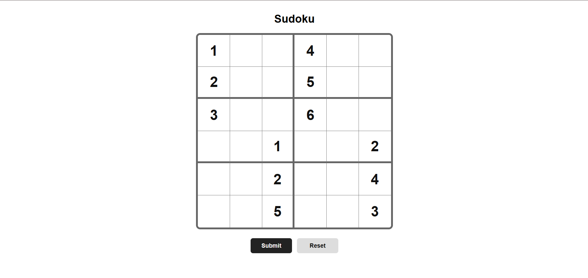
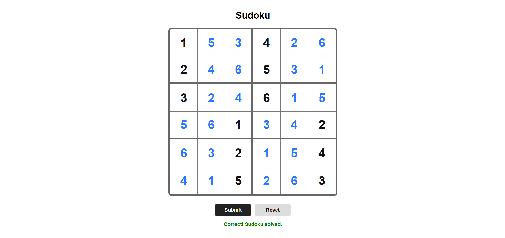

# Sudoku Game

A simple **Sudoku game** built with plain HTML, CSS, and JavaScript.

This project is intentionally kept simple and beginner-friendly. The goal is to have a small Sudoku game that is easy to understand, run, and modify.

## Preview

### Before Solving



### Solved Sudoku



> Put your two screenshots inside an `images` folder with these names:
> `sudoku-before.png` and `sudoku-solved.png`

## Features

- Sudoku board 6x6
- 6 larger boxes, with 6 small cells inside each
- Given numbers are already placed on the board
- Players can enter numbers from **1 to 6**
- Entering another number replaces the previous number in the same cell
- **Submit** button checks the solution
- **Reset** button clears the entered answers
- Simple and responsive layout
- Built without any external libraries or frameworks

## Tech Stack

- HTML
- CSS
- JavaScript

## Project Structure

```text
sudoku/
│
├── index.html
├── style.css
├── script.js
├── README.md
│
└── images/
    ├── sudoku-before.png
    └── sudoku-solved.png
```

## How to Run

No installation or setup is required.

1. Clone the repository:

```bash
git clone <https://github.com/Sumit1164/25-Javascript-Projects-for-beginner.git>
```

2. Open the project folder.

3. Open `index.html` in your browser.

That's it.

## How to Play

1. Look at the given numbers on the board.
2. Fill the empty cells using numbers **1–6**.
3. Click **Submit** to check your answer.
4. Click **Reset** to start again.

## Contributing

Contributions are welcome!

If you find a bug, have an idea for improving the game, or want to make the UI better, feel free to open an issue or submit a pull request.

Before submitting a pull request, please keep the code simple and make sure the existing functionality still works.
